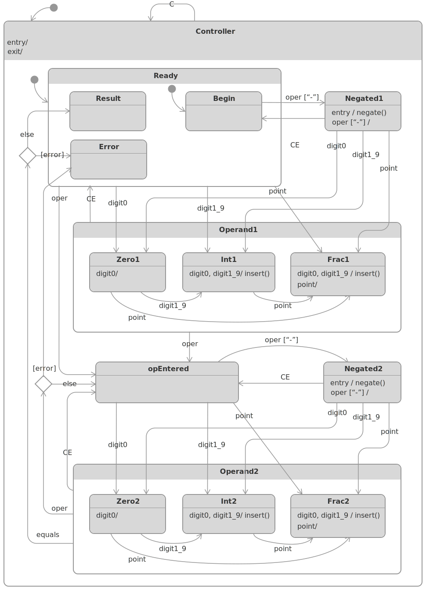

# HSMCalculatorDemo 

This package contains an Xcode project with an iOS _HSMCalculator_ demo app that demonstrates using [UML hierarchical state machine framework for Swift](https://github.com/SergeBouts/HSM).

Here's the statechart diagram of the application controller:

